Scoped to the active asset-tracking system — the redesigned core plus every table it actually connects to. Excluded deliberately: the `event_log`/`log_*` family (171 real rows, still untouched, not yet migrated) and fully-separate legacy tables (`tracks`, `vessels`, `cruises`, `sites`, `contacts`, `projects`, `piloting_category`) that don't connect into this structure. `changed_by → users` exists on almost every table (the generic audit trail) and is omitted from the diagram as repetitive — noted once here instead.

```mermaid
flowchart TD
    subgraph CORE["Core asset model"]
        assets["<b>assets</b><br/>serial_number, purchase_date,<br/>purchase_value_usd, notes"]
        asset_types["asset_types<br/>16 seeded, e.g. glider,<br/>ct_sensor, slocum_hull"]
        asset_assignments["<b>asset_assignments</b><br/>start_date, end_date, position"]
        asset_status_history["asset_status_history<br/>effective_date"]
        asset_status_options["asset_status_options<br/>lab, deployed, factory_service..."]
        asset_service_events["asset_service_events<br/>event_date, description"]
        asset_service_event_types["asset_service_event_types<br/>calibration, refurb,<br/>deployment_config..."]
        asset_faults["asset_faults<br/>severity, status lifecycle"]
        asset_battery_measurements["asset_battery_measurements<br/>voltage, weight, capacity"]
        documents["documents<br/>file_reference"]
    end

    subgraph DETAIL["Type-specific detail tables (1:1 with assets)"]
        asset_glider_details["asset_glider_details<br/>glider_name, wmo"]
        asset_sensor_details["asset_sensor_details<br/>depth_rating"]
        asset_battery_details["asset_battery_details<br/>date_of_manufacture"]
        asset_slocum_aft_section_details["asset_slocum_aft_section_details"]
        asset_slocum_end_cap_details["asset_slocum_end_cap_details"]
        asset_slocum_forward_section_details["asset_slocum_forward_section_details"]
        asset_slocum_payload_bay_details["asset_slocum_payload_bay_details"]
        asset_slocum_hull_details["asset_slocum_hull_details"]
    end

    subgraph SPEC["Model/spec lookups"]
        battery_models["battery_models<br/>nominal_voltage, chemistry"]
        hull_models["hull_models<br/>length, teledyne_part_number"]
        nvs_terms["nvs_terms<br/>NVS-backed vocabulary cache"]
    end

    subgraph CAL["Calibration history (current = latest by date)"]
        asset_ct_sensor_cal["asset_ct_sensor_cal"]
        asset_do_sensor_cal["asset_do_sensor_cal"]
        asset_eco_sensor_cal["asset_eco_sensor_cal"]
        asset_slocum_forward_section_cal["asset_slocum_forward_section_cal"]
    end

    subgraph SHARED["Shared reference (pre-existing, still active)"]
        institutes["institutes"]
        manufacturers["manufacturers"]
        platforms["platforms"]
        users["users"]
        missions["missions"]
    end

    subgraph BRIDGE["Backfill infra / legacy bridge"]
        legacy_asset_id_map["legacy_asset_id_map<br/>source_table, source_id → asset_id"]
        gliders["gliders<br/>(kept — norglider_missions/<br/>flask_missions still depend on it)"]
    end

    asset_assignments -->|child_asset_id| assets
    asset_assignments -->|parent_asset_id| assets
    asset_assignments -->|mission_id| missions
    assets -->|asset_type_id| asset_types
    assets -->|institute_id| institutes
    assets -->|manufacturer_id| manufacturers
    asset_status_history -->|asset_id| assets
    asset_status_history -->|status_id| asset_status_options
    asset_service_events -->|asset_id| assets
    asset_service_events -->|event_type_id| asset_service_event_types
    asset_faults -->|asset_id| assets
    asset_battery_measurements -->|asset_id| assets
    documents -->|asset_id| assets
    documents -->|mission_id| missions
    documents -->|service_event_id| asset_service_events
    documents -->|fault_id| asset_faults

    asset_glider_details -->|asset_id| assets
    asset_glider_details -->|platform_id| platforms
    asset_sensor_details -->|asset_id| assets
    asset_sensor_details -->|model_id, sensor_family_id| nvs_terms
    asset_battery_details -->|asset_id| assets
    asset_battery_details -->|battery_model_id| battery_models
    asset_slocum_aft_section_details -->|asset_id| assets
    asset_slocum_end_cap_details -->|asset_id| assets
    asset_slocum_forward_section_details -->|asset_id| assets
    asset_slocum_payload_bay_details -->|asset_id| assets
    asset_slocum_hull_details -->|asset_id| assets
    asset_slocum_hull_details -->|hull_model_id| hull_models

    battery_models -->|manufacturer_id| manufacturers
    battery_models -->|platform_id| platforms

    asset_ct_sensor_cal -->|asset_id| assets
    asset_do_sensor_cal -->|asset_id| assets
    asset_eco_sensor_cal -->|asset_id| assets
    asset_slocum_forward_section_cal -->|asset_id| assets

    legacy_asset_id_map -->|asset_id| assets
    missions -->|glider| gliders
```

Every box above also carries `id` as primary key (omitted from the labels for space) and most carry `changed_by → users` for the audit trail — both left off the diagram itself for legibility.

**Reading the shape**: `assets` is the hub everything radiates from — that's the whole point of the redesign, replacing what used to be 20+ disconnected per-type tables. The `DETAIL` and `CAL` clusters are both 1:1 extensions of `assets`, split for the same reason a real object gets its attributes split across normalized tables: `DETAIL` holds static descriptive fields, `CAL` holds dated history (current = latest row, same pattern as `asset_status_history`).
